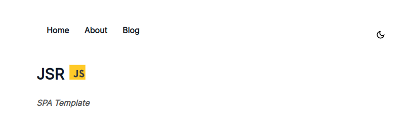

# JSR  -   SPA Template

[](https://opensource.org/licenses/MIT)



Live Demo : https://jsr.pages.dev/

---


### About
A beginners project for a Vite-Powered  single page web application with HTML, CSS, Javascript (Routing, Template literals) and Markdown.

---


### Getting Started

```bash
git clone https://github.com/phothinmg/jsr.git
```
```bash
cd jsr
```

```bash
npm install
```

```bash
npm run dev

```


Web app on :

[http://localhost:5173/](http://localhost:5173/)


##### Routing

`src/router.js`

```javascript
import { home,about } from "../page-blog/pages";
import blog from "../page-blog/blog";
// import yours 

class Router {
//    ***Router code 
}

//  Add your pages and posts 
//  Point yours <a href="/*"></a>
const Pages = {
  "/": new Router(home),
  "/about": new Router(about),
  "/blog/posts": new Router(blog.posts),
  "/blog/postOne": new Router(blog.postOne),
  "/blog/postTwo": new Router(blog.postTwo),
  "/blog/md": new Router(blog.md),
};
```


Router code are originally from https://github.com/iMykhailychenko/simple-router, edited by me.


> Template literals are used to write pages and blog posts.


##### Pages

`page-blog/pages.js`

```javascript
const home = `
<h3>Home</h3>
<p> This is home page</p>
`;

const about = `
<h3>About</h3>
<p> This is about page</p>
`;

// Add more pages and export to router.js
export {home,about}

```

##### Blog Posts

`page-blog/blog.js`


```javascript
const blog = {
    // Blog home
    posts: `
    <ol>
    <li><a href="/blog/postOne"  accesskey = "p1" >Post One</a></li>
    <li><a href="/blog/postTwo" accesskey = "p2" >Post Two</a></li>
    <li><a href="/blog/md" accesskey = "p3" >Markdown Example Post</a></li>
    </ol>
    
    `,
    // Add posts
    postOne: `
    <h3>Post One</h3>

   `,
    postTwo: `
    <h3>Post Two</h3>

   `,
//    Markdown between <md-block>
    
    md:`
    <md-block>

    Markdown syntax here 
    
    </md-block>
   `,

};
// Export to router.js
export default blog
```

More information about MD-Block  , visit https://md-block.verou.me/

## Resources

- [Simple CSS](https://simplecss.org/)
- [Simple javascript router](https://github.com/iMykhailychenko/simple-router)
- [MD-Block](https://md-block.verou.me/)

## Deployment

#### Configuring Vite


https://vitejs.dev/config/ .


#### Hosting 

1. [Cloudflare Pages ](https://pages.cloudflare.com/).  Documentation : https://developers.cloudflare.com/pages/get-started/guide/ .

2. [Vercel](https://vercel.com/) .   Documentation :  https://vercel.com/docs/getting-started-with-vercel

3. [Netlify](https://www.netlify.com/)  .   Documentation :   https://docs.netlify.com/


## LICENSE
[MIT](https://github.com/phothinmg/jsr/blob/main/LICENSE)


